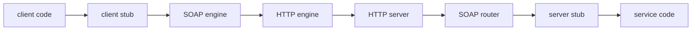
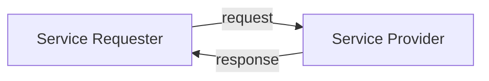
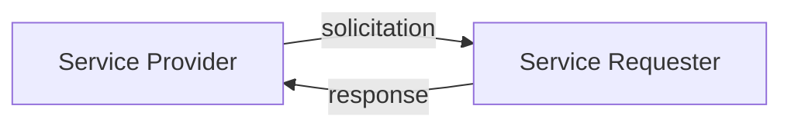
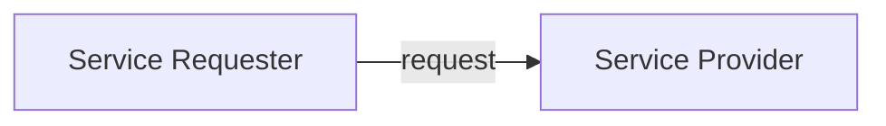
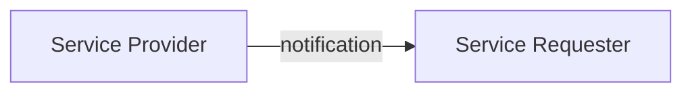

# Design e Arquitetura de Software

Este é um guia de assuntos relacionados a arquitetura de softwares.

# Paradigmas de Programação

**Software**: Matéria vital dos programas de computadores.
 É sequência, seleção, iteração e indireção. Nada mais e nada menos.
 
**Programação estruturada**
  - Disciplina imposta sobre a transferência direta de controle
  - Sequencial e Convencional

**Orientação a Objetos**
  - Disciplina imposta sobre a transferência indireta de controle
  - Plugins
  - Polimorfismo - Ponteiro em Funções - desde o fim da década de 1940 por Von Neumann
  - Inversão de Depêndencia
  - Desenvolvimento Independente
  - Implantação Independente

**Programação Funcional**
  - Disciplina imposta sobre atribuição de variáveis
  - Imutáveis - Create and Read

# Arquitetura Orientada a Serviço (SOA)

**Web Services**

>Em grandes empresas ou organizações, o código interno pode ser transformado em serviços
que podem ser usados por diferentes partes das empresas ou combinando mais dois serviços.
Esses serviços podem ser criados do zero ou adicionando interfaces ao software existente.

Uma vez implementados, os serviços podem ser usados para impulsionar os objetivos da empresa ou da organização.
**Ele deve ser:** Modular, Combinável, Independente de Plataforma, Idioma, Auto-descritivo, Catalogado.

> **Vamos olhar para trás?** 
> - *Em 1969, o antecessor da Internet, uma pequena rede de computadores chamada ARPANET, foi usado por pesquisadores nos Estados Unidos para enviar uma pequena quantidade de dados
entre pares de computadores. Esta foi a primeira vez que os dados foram enviados através de uma rede de computadores.* 
> - *Tim Berners-Lee começou a investigar como os documentos poderiam ser ligados entre si
através de redes. Em 1990, Lee propôs um sistema de gerenciamento web inspirado no hipertexto e
construído sobre a Internet, chamado World Wide Web. A World Wide Web, também conhecida como web, levou a padrões e tecnologias para comunicação baseada em computador através da Internet.*

**HTML**- *O texto nas páginas da Web é estruturado por meio de uma linguagem de marcação, HyperText Markup Language.*
**XML**- *É uma linguagem de marcação destinada a armazenar e transportar dados, Extensible Markup Language.*
**JSON**- *Formato que pode ser usado para armazenar e transportar dados, JavaScript Object Notation.*
**HTTP**-*HTTP é um protocolo que determina como a informação, incluindo o hipertexto, é transferida através da Internet. Existem várias versões de protocolo.*
**URI**-*Identificadores de recursos universais, são endereços usados para identificar recursos.*
**URL**-*Localizadores de Recursos Universais, são um subconjunto de URIs que são usados para localizar recursos. Ambos são usados para identificar o recurso, mas URLs também dizem ao protocolo como localizar e acessar o recurso*

**Remote Procedure Call (RPC)**
> *Chamadas de Procedimento Remoto*- O RPC foi projetado especificamente como um componente de middleware para
sistemas em rede e foi estendido para melhorar sua flexibilidade e usabilidade. Como o nome indica, uma chamada de procedimento remoto permite que os clientes invoquem procedimentos que são implementados em um servidor.
Aqui, o cliente e o servidor estão em máquinas completamente separadas ou são uma instância virtual diferente na mesma máquina. 

**Object Brokers**
> *CORBA*-A arquitetura de agente de objeto mais comum é chamada de Arquitetura Common Object Request Broker. Apesar de ter a palavra arquitetura em seu nome, CORBA está mais intimamente relacionado com um conjunto de padrões. Concebido pelo Grupo de Gerenciamento de Objetos, ou OMG, o CORBA tem como objetivo fornecer um esboço do que deve ser incluído em corretores de objetos. O padrão não é um guia de instruções para implementação.
Como existem inúmeras linguagens orientadas a objetos, o principal objetivo da CORBA é criar uma especificação que permita que os corretores de objetos sejam independentes das linguagens de programação usadas para implementar clientes e servidores. CORBA especifica que os corretores de objetos devem ser capazes de funcionar independentemente do sistema operacional. 
A intenção é que, se um sistema requer middleware para manipular a computação distribuída, os desenvolvedores não precisam ser restritos aos requisitos de idioma e sistema operacional do middleware.

**Web Services de primeira geração**
> *O que é*-Um serviço é alguma funcionalidade que é exposta para uso por outros processos. Em outras palavras, um serviço tem uma interface que pode ser usada por algum solicitante de serviço. Um serviço Web, então, é uma funcionalidade que é exposta e acessível usando tecnologias da Web.

> Quais são alguns dos motivos pelos quais o Enterprise Application Integration (EAI) não é comumente usado em cenários business-to-business (B2B)?

> - Não é óbvio onde colocar o middleware

> - As empresas querem manter o controle sobre seus dados

> - A segurança pode ser um problema

**Como são chamados?** 
> Para que um solicitante de serviço use um serviço específico, ele deve chamá-lo. Invocar é como uma chamada de método em uma linguagem orientada a objeto, exceto que ele deve ser feito através de uma solicitação em XML. A invocação incluirá qual operação é solicitada, uma vez que um serviço pode oferecer vários, juntamente com os parâmetros em Dados. Na invocação de serviços Web é feita com SOAP, uma especificação de protocolo que é baseada em XML e permite que os serviços enviem informações uns aos outros. SOAP ao mesmo tempo representava Simple Object Access Protocol. Embora este significado tenha sido descartado. Solicitantes de serviço e provedores de serviços usam essas mensagens SOAP para enviar informações uns aos outros. Uma vez que as mensagens são baseadas em XML e enviadas através de infraestrutura web universalmente aceita, sistemas codificados em diferentes idiomas e em diferentes plataformas podem facilmente se comunicar.

**Como são descritos?**
> Para que os serviços interajam, eles devem saber como interagir. Linguagens de descrição do serviço Web ou WSDL é o protocolo padrão para descrever a interface de um serviço. Como SOAP, as descrições WSDL são escritas em XML. Uma descrição WSDL descreverá a interface de um serviço de forma legível por máquina para que um solicitante de serviço possa se vincular a essa interface. Vinculação é o ato de gerar o código necessário para interagir com um serviço para que um solicitante de serviço possa começar a chamá-lo. Se uma interface de serviço é descrita de forma inequívoca com WSDL, a vinculação pode ser feita gerando o código necessário automaticamente.

**Como são publicados e descobertos?**
> A internet é um lugar grande, solicitantes de serviços e prestadores de serviços precisam de maneiras de entrar em contato. Os provedores de serviços podem publicar descrições de seus serviços usando UDDI, descrição universal, descoberta e integração. UDDI é usado para construir registros públicos ou privados de serviços web. Solicitantes de serviço que procuram um serviço podem pesquisar pelas descrições WSDL ou outros aspectos do serviço. Isso é chamado de descoberta, juntos SOAP, WSDL e UDDI são os três padrões fundamentais de serviços web. Eles permitem que os serviços Web sejam invocados por solicitantes de serviço, para se descrever e para ser publicado registros onde eles podem ser descobertos. Todos eles dependem da infraestrutura da Web.

**Como são combinados:**
> Composição é a ação de coordenar vários serviços e fornecer uma interface. A reutilização pode ser alcançada por agregação.
> No contexto de webservices seria determinar a ordem e lidar com exceções que podem surgir podendo ser chamado de coordenação.
> *BPEL* - Businnes Process Execution Language - Linguagem padrão de composição de alto nível para serviços web.

*Quais são os três padrões fundamentais dos Web Services de primeira geração?*

> - WSL é a especificação para descrever interfaces de serviço da web.
> - SOAP é o padrão usado para invocar serviços da web - Robusto, Modular e Extensível.
> - A UDDI reúne provedores de serviços e solicitantes de serviços, oferecendo publicação e descoberta.

## SOAP
> - Simple Object Access Protocol -  é um protocolo padrão projetado originalmente para possibilitar a comunicação entre aplicações desenvolvidas em diferentes linguagens e plataformas.

**Estilo comum para invocações SOAP**

> - *RPC* - O estilo de chamada de procedimento remoto se parece com uma chamada de método, onde você invoca um processo e passa parâmetros. No entanto, eles não são como uma simples chamada de método em OO, pois precisam de muitas informações extras, como o protocolo de transporte.

> - *Document* - Nesse estilo, o tipo de formulário enviado informa ao serviço o que fazer e os campos no formulário são como os parâmetros são passados.

*Comunicação Default SOAP*

**Existem quatro padrões básicos de mensagens possíveis com SOAP**

*Request-Response*
>O padrão de resposta da solicitação é quando o solicitante do serviço envia pela primeira vez uma mensagem, em seguida, recebe uma resposta do provedor de serviços.
> Este processo é síncrono. Ele pode ser implementado através de HTTP.
> Inerentemente síncrono.

*Solicitation-Response*
>Também é síncrona, o provedor de serviços, faz uma solicitação para o solicitante do serviço. Isso geralmente é uma confirmação.

*One-Way*
>No padrão de comunicação unidirecional, o solicitante de serviço envia uma solicitação para o provedor de serviços, as nenhuma resposta é esperada. Isso pode ser uma notificação simples de que o solicitante do serviço está ativo e em execução.
>Esse padrão é inerentemente assíncrono, uma vez que nenhuma resposta é esperada.

*Notification*
>No padrão de mensagem de notificação, o provedor de serviço envia uma notificação para o solicitante sem esperar uma resposta. Este modelo é adequado para sistemas baseados em eventos, onde há editores e assinantes, como um blog ou um serviço de notificação meteorológica.
>Esse padrão de mensagens também é assíncrono.

## UDDI
> - Universal Description, Discovery and Integration, Descrição, Descoberta e Integração Universais - Lançado em 2000, define um padrão de publicar e descobrir informações sobre serviços da Web.
> Hoje, gerenciado pela OASIS. Não é um componente obrigatório para implementação de serviços web. Tem o papel de Reunir provedores de serviços e solicitantes de serviços mas também tem o papel de publicar e manter esses serviços.
> As informações são divididas em 3 categorias: 
> - Páginas brancas - Informações básicas sobre o negócio como nome, descrição e telefone.
> - Páginas amarelas - Informações hierarquicas sobre o serviço da empresa e subconjuntos.
> - Páginas verdes - Informações técnicas de como utilizar o serviço.
> O UDDI permite que os serviços sejam publicados e descobertos, mas um registro UDDI também é um provedor de serviços!
> Alguns dos serviços que oferece são adicionar negócios ou serviços ou alterar informações sobre serviços.

## REST

> *RE*presentational *S*tate *T*ransfer - Transferência de estado representacional
> Ele é usado em aplicativos distribuídos usando HTTP para enviar mensagens para se comunicar entre componentes. Nos termos mais básicos, REST é uma arquitetura cliente-servidor baseada em um design de resposta de solicitação. O cliente envia a solicitação e o servidor responde. No entanto, uma característica específica do REST é que a comunicação é baseada em recursos. Isso significa que as mensagens são enviadas como representações de recursos. Um recurso pode ser qualquer pedaço de informação que é auto-suficiente. Exemplos de recursos são documentos, imagens, representações de objetos e assim por diante.

**São 5 as restriçoes de definição da arquitetura Rest**

* Cliente-Servidor
> REST tem cinco restrições que estabelecem suas características definidoras. A primeira restrição é que REST é uma arquitetura cliente-servidor. Para atualizar, uma arquitetura cliente-servidor aplica a separação de preocupações por ter funções com responsabilidades específicas, o cliente e o servidor, que interagem entre si. O servidor fornece serviços ao cliente, como criar ou manipular dados, e o cliente fornece aos usuários uma interface de usuário para acessar esses serviços. Essa separação permite que os aplicativos REST sejam altamente escaláveis. Ele permite que o desenvolvimento do cliente e do servidor ocorra independentemente um do outro. Como o cliente não está preocupado com o armazenamento ou manipulação de dados, ele pode ser melhorado para fornecer aos usuários uma interface de usuário simples e rápida. O servidor também pode ser mais escalável, permitindo que conjuntos maiores de dados sejam manipulados, porque é libertado da necessidade de implementar quaisquer responsabilidades do cliente.

* Sistema em Camadas
> REST é um sistema em camadas. Ele pode consistir em várias camadas arquitetônicas de software ou hardware chamadas pelo cliente e servidor. Essas camadas podem ser usadas para melhorar o desempenho, traduzir mensagens, gerenciar tráfego e muito mais. Isso ajuda a melhorar a reutilização dos serviços Web REST porque camadas podem ser adicionadas e removidas com base nos serviços necessários do cliente.

* Iterações Apátrias (Stateless)
> As interações devem ser apátridas. Isso significa que o servidor não salva informações sobre o estado atual do cliente ou solicitação anterior feita pelo cliente. Além de quando uma solicitação é feita, o servidor não precisa saber que o lado do cliente existe. Além disso, cada solicitação é independente um do outro e deve conter todas as informações necessárias para que o servidor entenda e responda à solicitação. Se houver alguma informação necessária pelo servidor para concluir uma solicitação, o cliente deve enviá-la sempre que o servidor não dependerá de informações enviadas de solicitações anteriores. Novamente, esta restrição melhora o desempenho dos serviços Web porque o servidor não tem de armazenar quaisquer informações sobre os estados actuais dos clientes no sistema. Sem a sobrecarga, o servidor pode fornecer melhor desempenho aos clientes. No entanto, isso impõe restrições significativas à maneira como um cliente e um servidor se comunicam. Toda vez que um cliente envia uma solicitação para um servidor, ele deve fornecer e armazenar informações sobre seu estado atual para manter essa restrição sem estado. Por exemplo, se a autenticação for necessária por um servidor para que um cliente tenha acesso aos dados, o lado do cliente deve enviar essas informações de autenticação em cada solicitação.

* Cache
> Clientes podem armazenar em cache. Isso significa que os clientes podem manter uma cópia local de uma resposta do servidor a ser usada para solicitações posteriores. Basicamente, toda vez que um servidor responde a uma solicitação de cliente, o servidor adiciona informações à resposta para rotulá-la como armazenável em cache ou não armazenável em cache. Ele faz isso para melhorar o desempenho para que ele possa reduzir o número de solicitações para os mesmos recursos. Isso também pode aliviar alguns dos impactos negativos da aplicação da restrição apátrida. O servidor decide para o lado do cliente quais informações devem ser temporariamente salvas e o que pode ser excluído após o uso, para que o cliente não mantenha quaisquer dados redundantes ou inúteis.

* Interface Uniforme
> Existe uma interface uniforme para comunicação entre o cliente e o servidor. Métodos específicos são compreendidos. REST usou os métodos HTTP comuns. GET, PUT, POST e DELETE para comunicar as diferentes ações que o cliente deseja executar no recurso. Em segundo lugar, o recurso deve ser identificado na solicitação usando um identificador de recurso uniforme específico, ou URI. 

**Boas práticas na construção de API Rest**

> - Use apenas substantivos para seu URI. 
> - Os métodos GET não devem alterar o estado dos seus recursos. 
> - Use substantivos plurais para seu URI. 
> - Use sub-recursos para relacionamentos entre recursos.
> - Use cabeçalhos HTTP para especificar o formato de saída de entrada.
> - Forneça aos usuários filtragem e paginação para coleções. 7, versão da sua API. 8, forneça códigos de status HTTP adequados.

## Microservices

> Os microsserviços podem ser considerados como uma variação de SOA aplicada em uma escala de aplicativos em vez de escala corporativa. Além disso, alguns princípios SOA foram refinados para oferecer melhor suporte aos sistemas de escala de aplicativos. O estilo arquitetônico de microsserviços é a forma de compor microsserviços para produzir aplicações complexas. Um microsserviço é o processo que é responsável por executar uma única tarefa independente. Normalmente, um microsserviço é criado para executar uma capacidade comercial específica. Por exemplo, em um aplicativo, um microsserviço pode ser responsável pela implementação de um recurso de pesquisa. Outro microsserviço pode implementar um recurso de recomendação. E ainda outro microsserviço pode ser responsável pela implementação de um recurso de classificação. Os microsserviços são desenvolvidos e existem de forma independente. Mas, em última análise, eles são compostos juntos para fornecer a funcionalidade geral de um aplicativo. Muitas vezes, cada microsserviço não obedece a um estilo arquitetônico completo em camadas porque os microsserviços são compostos com outros microsserviços e nem sempre destinados aos usuários finais. As camadas de apresentação e aplicação podem nem sempre estar presentes, ou seja, geralmente cada microsserviço controla e gerencia seus próprios dados. Como resultado, o aplicativo geral geralmente não seguirá um estilo arquitetônico em camadas. 

**Desvantagens**

> Um aplicativo composto por microsserviços é o sistema distribuído habilitado por meio de comunicação assíncrona. Isso significa que algum gerenciamento centralizado de todos os microsserviços será necessário para coordenar todos os microsserviços. Os bancos de dados provavelmente serão distribuídos por vários microsserviços, e as transações podem abranger vários microsserviços. Sem algum gerenciamento central, o estado geral do aplicativo poderia se tornar inconsistente e resultar em erros. Testar um sistema distribuído é mais complexo, devido à mudança das condições de teste. Difícil de reproduzir bugs pode ser introduzido a partir das interações complexas entre microsserviços. Outra coisa a considerar é como o aplicativo irá lidar quando um microsserviço falhar e não há outra instância do microsserviço para tomar seu lugar. Os outros microsserviços no aplicativo devem ser robustos o suficiente para lidar com a falha graciosamente, pois eles podem confiar diretamente no microsserviço com falha.
